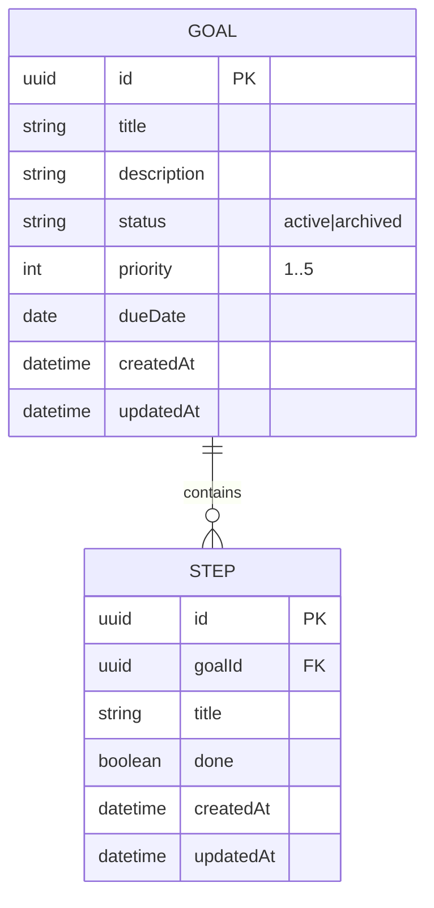

````md
# ER diagram


```mermaid
erDiagram
  GOAL ||--o{ STEP : contains

  GOAL {
    uuid id PK
    string title
    string description
    string status "active|archived"
    int priority "1..5"
    date dueDate
    datetime createdAt
    datetime updatedAt
  }

  STEP {
    uuid id PK
    uuid goalId FK
    string title
    boolean done
    datetime createdAt
    datetime updatedAt
  }
```
````
